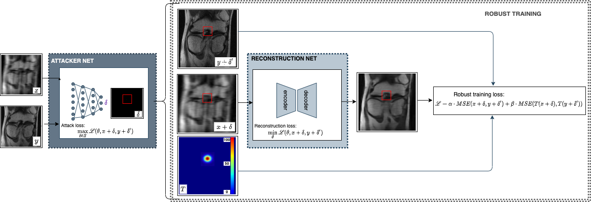
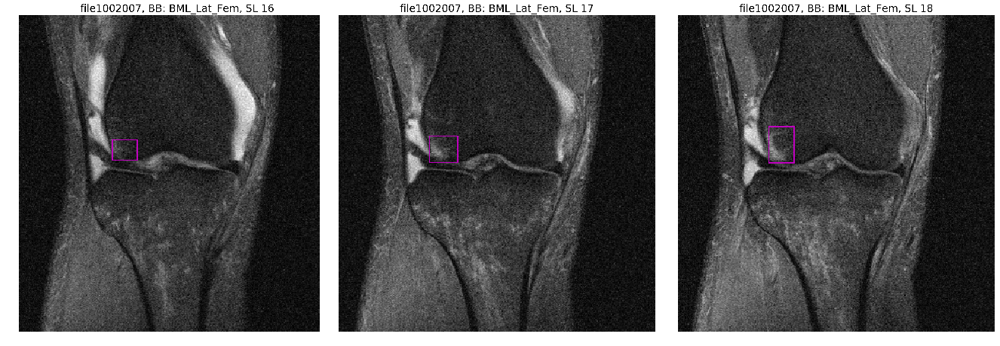

# Adversarial Robust Training of Deep Learning MRI Reconstruction Models

This repository contains the abnormalities annotation of the knee fastMRI dataset, which were utilized in our paper:<br>["Adversarial Robust Training of Deep Learning MRI Reconstruction Models"](https://pdf), which was recently submitted to the Medical Imaging with Deep Learning (MIDL) 2020 Conference Special Issue at the Machine Learning for Biomedical Imaging (MELBA) Journal.

This work extends our paper ["Addressing The False Negative Problem of MRI Reconstruction Networks by Adversarial Attacks and Robust Training"](https://2020.midl.io/papers/cheng20.html) by Cheng, K., Caliva,F., et al.,2020 which was Awarded Best Paper at MIDL 2020 Conference. 

## Update
Please check out (https://github.com/victorychain/FNAF-fastMRI) for the official FNAF implementation.
Soon we will release code and pre-trained model of the abnormality classification network. 

## Abstract
Deep Learning has shown potential in accelerating Magnetic Resonance Image acquisition and reconstruction. Nevertheless, there is a dearth of tailored methods to guarantee that the reconstruction of small features is achieved with high fidelity. In this work, we employ adversarial attacks to generate small synthetic perturbations that when added to the input MRI, they are not reconstructed by a trained DL reconstruction network. Then, we use robust training to increase the network's sensitivity to small features and encourage their reconstruction.
Next, we investigate the generalization of said approach to real world features. For this, a musculoskeletal radiologist annotated a set of cartilage and meniscal lesions from the knee Fast-MRI dataset, and a classification network was devised to assess the features reconstruction. Experimental results show that by introducing robust training to a reconstruction network, the rate (4.8\%) of false negative features in image reconstruction can be reduced. The results are encouraging and highlight the necessity for attention on this problem by the image reconstruction community, as a milestone for the introduction of DL reconstruction in clinical practice. To support further research, we make our annotation publicly available.

## Dataset Annotation
A total of 418 MR exams from the knee Fast-MRI dataset were annotated, 321 and 97 exams from the training and validation sets respectively. The exams included coronal knee sequences, proton density-weighted with and fat suppression. For more details about the acquisition parameters, interested readers are invited to refer to ["Fast-MRI dataset"](https://fastmri.med.nyu.edu/).
Each MRI volumes were examined for cartilage, meniscus, bone marrow lesions (BML), cysts, and based on the Whole Organ Magnetic Resonance Scoring (WORMS) scale,  by the MSK radiologist involved in the study. Bounding boxes were placed for cartilage and BML in 4 sub-regions of the knee at the tibio-femoral joint; medial and lateral femur, medial and lateral tibia. Cartilage lesion were defined as partial or full thickness defect observed in one or more slices extending to include any breadth. Bone marrow lesions annotated included any increased marrow signal abnormality adjacent to articular cartilage in one or more slices, at least encompassing 5\% of the articular marrow region.
Similar bounding boxes were placed in the two sub-regions of meniscus: medial and lateral. Meniscal lesions were defined to include intrasubstance signal abnormality, simple tear, complex tear or maceration. Given the sparse occurrence of the cysts, a single bounding box label was used to encompass all encountered cystic lesions in any of the sub-regions. The Figure below is exemplary of the performed annotations depicting the presence of Bone Marrow Lesion in Lateral Femur subjacent to articular cartilage, which extends across multiple slices.


In summary the abnormalities annotation follows this naming convention:
<br>'CartMedFem' --> Medial Femoral Cartilage Lesion
<br>'CartLatFem' --> Lateral Femoral Cartilage Lesion
<br>'CartMedTib' --> Medial Tibial Cartilage Lesion
<br>'CartLatTib' --> Lateral Tibial Cartilage Lesion
<br>'BML_Med_Fem' -->Bone Marrow Lesion in Medial Femur subjacent to articular cartilage
<br>'BML_Lat_Fem' -->Bone Marrow Lesion in Lateral Femur subjacent to articular cartilage
<br>'BML_Med_Tib' -->Bone Marrow Lesion in Medial Tibia subjacent to articular cartilage
<br>'BML_Lat_Tib' -->Bone Marrow Lesion in Lateral Tibia subjacent to articular cartilage
<br>'Med_Men' --> Lesion in Medial Meniscus
<br>'Lat_Men' --> Lesion in Lateral Meniscus
<br>'Cyst'  

## Design of the Proposed Model


## Annotation example


## Requirements
- The code has been written in Python (3.6)

## Preparing your data
Please download the ["Fast-MRI dataset"](https://fastmri.med.nyu.edu/) using the official website.
An example of MRI volume from the dataset is added in [dataset](https://github.com/fcaliva/fastMRI_BB_abnormalities_annotation/dataset/singlecoil_val/)

Once downloaded the dataset, please maintain its organization in two folders namely: `singlecoil_train` and `singlecoil_val`.

## Running example code
Note: Set the data path appropriately in `fastMRI_abnormalities_BB_annotation/main.py` before running the code.
To run the code you simply need to use the following script:
```
python main.py --run_example
```
## Running code
Note: <br>
Set the data path appropriately in `fastMRI_abnormalities_BB_annotation/main.py` before running the code.

To run the code you simply need to use the following script:
```
python main.py --fastMRI 'path/to/fastMRI/dataset/' --annotation 'path/to/fastMRI/annotation/' --split 'train or val' --save_in 'path/to/where/to/save/'
```
Example:
```
python main.py --fastMRI '/data/bigbone5/vcheng/fastMRI/datasets/' --annotation 'fastMRI_csv/' --split 'val' --save_in 'BB_png'
```
## Citation
If you use this annotation for your research, please consider citing our paper.
```
@article{caliva2020adversarial,
  title={Adversarial Robust Training in MRI Reconstruction},
  author={Caliv{\'a}, Francesco and Cheng, Kaiyang and Shah, Rutwik and Pedoia, Valentina},
  journal={arXiv preprint arXiv:2011.00070},
  year={2020}
}
```
